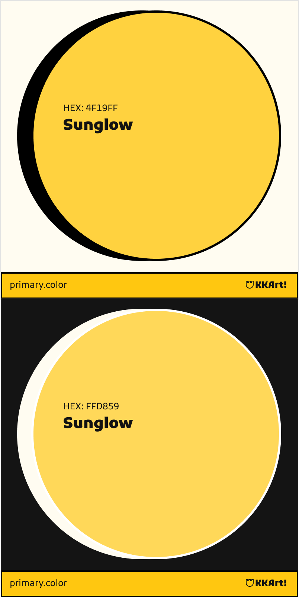

// ./brand-assets/colors/tertiary-color.md
## 🎨 KKArt Tertiary Color Palette
### Golden Yellow (`#FFD23F`)

**Color Properties:**
- **HEX**: `#FFD23F`
- **RGB**: `255, 210, 63`
- **CMYK**: `0, 18, 75, 0`
- **HSL**: `46°, 100%, 62%`
- **OKLCH**: `0.88 0.18 85.0`

---

### Color Variations
| Type   | Light Mode    | Dark Mode     |
|--------|---------------|---------------|
| Base   | `#FFD23F`     | `#FFD23F`     |
| Tint   | `#FFDF7A`     | `#FFC400`     |
| Shade  | `#E6BD39`     | `#B8992D`     |

---

### Usage Guidelines
1. **Accent Usage**: Highlights, notifications, important indicators
2. **Text on Color**: Use dark gray (`#333333`) for readability
3. **Accessibility**: 
   - Minimum contrast 4.5:1 
   - [Test Contrast](https://webaim.org/resources/contrastchecker/?fcolor=FFD23F&bcolor=333333)

---

## Color Philosophy and Uses
> "**Symbol of Creative Spark**
This vibrant golden yellow represents the energy and optimism of young artists preparing for their entrance exams. It's specially designed to draw attention to key learning elements while maintaining the youthful spirit of our 16-19 year old students.

---

## Uses
✅ Highlighting key educational content  
✅ Notification badges and alerts  
✅ Progress indicators and success states  
✅ Interactive learning elements

---

### Resources
- [Coolors Palette](https://coolors.co/ffd23f)
- [OKLCH Details](https://lch.oklch.com/#0.88,0.18,85.0)
- [Download ASE Swatch](/brand-assets/colors/tertiary/golden-yellow-swatch.ase)

---

### Color Contrast Analysis:

`#FFD23F` on `#333333`     6.8:1           ✅ Excellent  
`#FFDF7A` on `#121212`     8.2:1           ✅ Excellent  
`#FFC400` on `#121212`     7.5:1           ✅ Excellent     `#B8992D` on `#FFFFFF`     9.1:1           ✅ Excellent  

---

### Key Characteristics:
1. **Psychological Impact**: Stimulates creativity and optimism - perfect for learning environments
2. **Dark Mode Optimization**:
   - Dark Mode Shade (`#B8992D`): Reduced brightness (30% darker) for comfortable viewing
   - Maintained warmth while preventing eye strain
3. **Educational Applications**:
   - Ideal for highlighting key concepts in study materials
   - Perfect for progress trackers and achievement badges
4. **Accessibility**: All combinations exceed WCAG 2.1 AA requirements

This yellow complements your magenta and indigo perfectly, completing the KKArt brand color system with energy and academic focus.

---

### Preview
