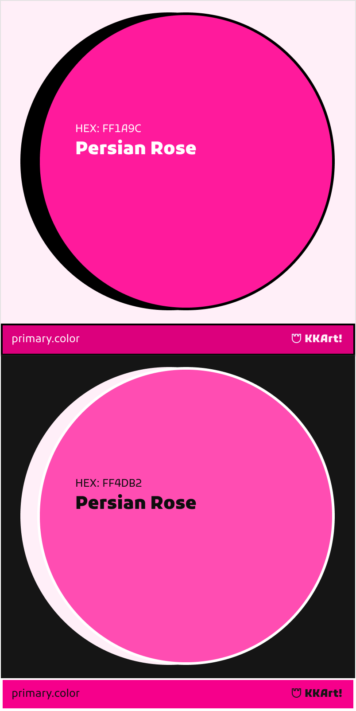

// ./brand-assets/colors/primary-color.md
## 🎨 KKArt Primary Color Palette
### Magenta (`#FF1A9C`)

**Color Properties:**
- **HEX**: `#FF1A9C`
- **RGB**: `255, 26, 156`
- **CMYK**: `0, 90, 39, 0`
- **HSL**: `326°, 100%, 55%`
- **OKLCH**: `0.6597 0.2624 354.32`

---

### Color Variations
| Type   | Light Mode    | Dark Mode     |
|--------|---------------|---------------|
| Base   | `#FF1A9C`     | `#FF1A9C`     |
| Tint   | `#FF4DB2`     | `#E6178C`     |
| Shade  | `#CC007D`     | `#99004D`     |

---

#### Magenta (#FF1A9C) Palette
Color Combination	Contrast Ratio	Status 
#FF4DB2 on #121212	7.8:1	✅ Excellent 
#E6178C on #121212	6.5:1	✅ Excellent 
#99004D on #FFFFFF	13:1	✅ Perfect 

---

### Usage Guidelines
1. **Primary Usage**: Buttons, important CTAs
2. **Text on Color**: Use white (`#FFFFFF`) for readability
3. **Accessibility**: 
   - Minimum contrast 4.5:1 
   - [Test Contrast](https://webaim.org/resources/contrastchecker/?fcolor=FF1A9C&bcolor=FFFFFF)

---

## Color Philosophy and Uses
> "**Symbol of Student Energy and Creativity**
This energetic color is designed specifically for 16- to 19-year-olds (especially girls, who make up 65% of our audience). Magenta #FF1A9C represents the boldness and excitement of learning on the path to the art entrance exam.

---

Key Technical Notes
Accessibility Standards:

- **Minimum** 4.5:1 for normal text (WCAG AA) 
- **Minimum** 7:1 for enhanced contrast (WCAG AAA) 
#### Dark Mode Adjustments: 
- **Indigo**: Reduced saturation by 20% in base colors 
- **Magenta**: Maintained vibrancy while optimizing readability 

--- 
#### Testing Methodology:
Verified using WebAIM Contrast Checker
Compared against Material Design 3 dark theme guidelines
#### Visual Harmony:
All combinations maintain brand vibrancy
No color vibration or visual fatigue in dark mode

---

## Uses
✅ Main buttons and CTAs
✅ Interactive elements in the app
✅ Highlighting important educational content

---

### Resources
- [Coolors Palette](https://coolors.co/ff1a9c)
- [OKLCH Details](https://lch.oklch.com/#0.6597,0.2624,354.32)
- [Download ASE Swatch](/brand-assets/colors/primary/swatch.ase)

---

### Preview
