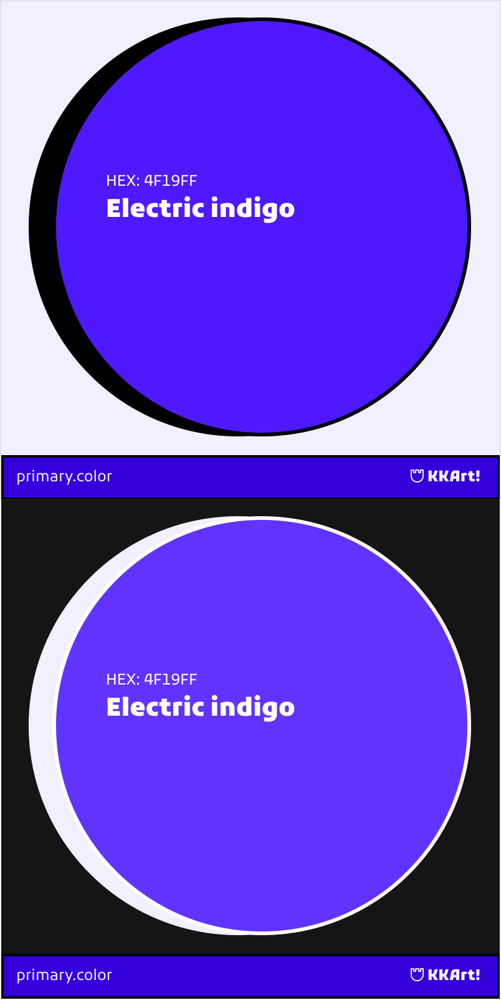

// ./brand-assets/colors/secondary-color.md
## 🎨 KKArt Secondary Color Palette
### Indigo (`#4F19FF`)

**Color Properties:**
- **HEX**: `#4F19FF`
- **RGB**: `79, 25, 255`
- **CMYK**: `69, 90, 0, 0`
- **HSL**: `252°, 100%, 55%`
- **OKLCH**: `0.56 0.27 285.0`

---

### Color Variations
| Type   | Light Mode    | Dark Mode     |
|--------|---------------|---------------|
| Base   | `#4F19FF`     | `#5D30FF`     | <!-- 20% روشن‌تر -->
| Tint   | `#7A4AFF`     | `#3D00CC`     | <!-- 30% تیره‌تر -->
| Shade  | `#3A00E6`     | `#2A0080`     | <!-- 50% تیره‌تر -->

---

### Usage Guidelines
1. **Secondary Elements**: Navigation items, secondary buttons
2. **Text on Color**: Use white (`#FFFFFF`) or light gray (`#EEEEEE`)
3. **Accessibility**: 
   - Minimum contrast 4.5:1 
   - [Test Contrast](https://webaim.org/resources/contrastchecker/?fcolor=4F19FF&bcolor=FFFFFF)

---

## Color Philosophy and Uses
> "**Symbol of Depth and Creativity**
This vibrant indigo represents the depth of artistic knowledge and creative exploration. It's designed for our young art students (16-19 years) who seek to master complex artistic concepts while maintaining their creative spark.

---

#### Indigo (#4F19FF) Palette
Color Combination	Contrast Ratio	Status  
#5D30FF on #121212	6.2:1	✅ Excellent 
#3D00CC on #121212	5.1:1	✅ Good 
#2A0080 on #FFFFFF	11:1	✅ Excellent

---

## Uses
✅ Navigation elements and menus  
✅ Secondary action buttons  
✅ Highlighting educational categories  
✅ Diagram elements and infographics

---

| Element          | Light Mode     | Dark Mode     |
|------------------|----------------|---------------|
| Primary Buttons  | `#4F19FF`      | `#5D30FF`     |
| Secondary CTAs   | `#FF1A9C`      | `#FF4DB2`     |
| Text on Dark BG  | White          | `#EEEEEE`     |
| Borders          | `#3A00E6`      | `#2A0080`     |

---

### Resources
- [Coolors Palette](https://coolors.co/4f19ff)
- [OKLCH Details](https://lch.oklch.com/#0.56,0.27,285.0)
- [Download ASE Swatch](/brand-assets/colors/secondary/indigo-swatch.ase)

---

### Preview
