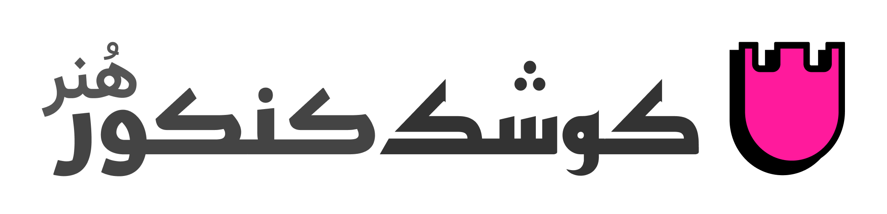
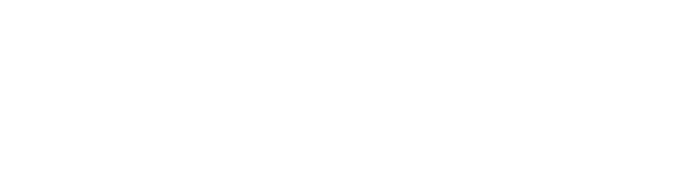

# KKArt! Brand Guide (v0.0.1)

Welcome to the official brand guide for KKArt. This document is the central hub for all our brand assets and guidelines.

## 1. Voice & Tone

## ⛫ KKArt: راهنمای لحن صدای برند
## اصل اساسی: 
باوقار اما رک
صدای ما، صدای یک مربی متخصص و مورد اعتماد است. ما احترام و اقتدار لازم برای ایجاد اعتماد به نفس را با صداقت و شفافیت لازم برای ارائه راهنمایی واقعی و عملی برای آزمون هنر کنکور ترکیب می‌کنیم.

## دو رکن صدای ما
### 1. باوقار
این بدان معناست که ما محترم، معتبر و خونسرد هستیم. ما با جاه‌طلبی‌های دانش‌آموزانمان با جدیتی که شایسته آن هستند برخورد می‌کنیم و در یک محیط استرس‌زا، حضوری ثابت و آگاهانه ارائه می‌دهیم.

### ۲. رک و راست
این به این معنی است که ما صادق، رک و صریح هستیم. ما معتقدیم که موثرترین راه برای کمک، رک، شفاف و عملی بودن است.
---
## 2. Core Assets

### 🎨 Colors
Our color palette is vibrant and energetic. Full details for each color are available in their respective files.

- **[Primary: Magenta](https://coolors.co/ff1a9c)**
- `HEX`: `FF1A9C`
- **[Secondary: Indigo](https://coolors.co/4f19ff)**
- `HEX`: `4F19FF`
- **[Accent: Golden Yellow](https://coolors.co/4F19FF)**
- `HEX`: `4F19FF`
---
### ✒️ Logos
> Download our official logos from the link below. Guidelines on usage are included.
---
- [Download Logo Colored](../assets/logos/kkart-logo-colored-light.svg)

- [Download Logo Monochrome](../assets/logos/kkart-logo-monochrome-white.svg)

---
### ✍️ Typography
#### Fonts
---
**Brand Font**: 
Our brand uses the "**Reem Kufi**" font family. 
Reem Kufi is a Kufic typeface based on early Kufic (**Mushafi**) models, but retrofitted to the Fatimid Kufic grid and with borrowing from its forms.
- **[Download ReemKufi font](https://font.download/dl/font/reem-kufi.zip)**
---
**Headings Font**: 
Our Headings and Titles uses the "**Kufam**" font family. 
Kufam is an Arabic-Latin bilingual typeface intended for contemporary information design such as signage and wayfinding systems.
- **[Download Kufam font](https://font.download/dl/font/kufam-2.zip)**
---
**Texts Font**: 
Our Texts uses the "**VazirMatn**" font family. 
Vazirmatn project is a **Persian**-Arabic typeface family with nine weights started in 2015 under the name of Vazir and its design and development continued during these years. The Vazirmatn font has a simple and smooth form and can be used in most contexts. For Latin glyphs the Roboto font has been used. This is a free and open source software.
- **[Download VazirMatn font](https://github.com/rastikerdar/vazirmatn/releases/download/v33.003/vazirmatn-v33.003.zip)**
---
